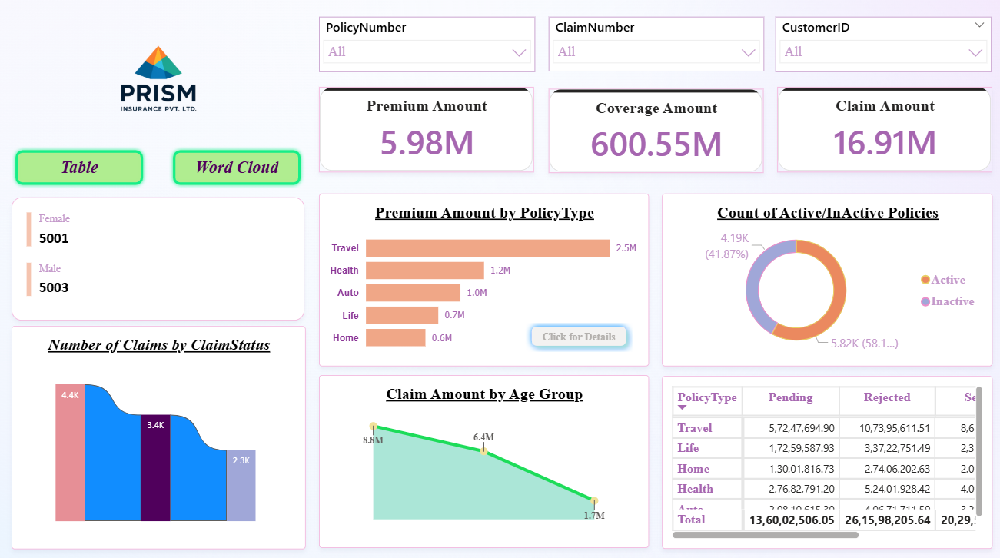

# 📊 PRISM Insurance Dashboard -- README

## 📌 Overview

This Power BI dashboard provides a comprehensive view of **insurance
policies, premiums, and claims** for PRISM Insurance Pvt. Ltd. It
enables quick analysis of key business metrics such as **premium amount,
coverage, claim amount, policy status, and claim distribution**.

---
## 🎯 Key Features

-   **Dynamic Filters** -- Select **Policy Number, Claim Number, or
    Customer ID** to filter all visuals.
-   **KPI Cards** -- Show **Total Premium Amount, Total Coverage, and
    Total Claim Amount**.
-   **Gender Distribution** -- Displays **number of male and female
    customers**.
-   **Premium Analysis** -- Breaks down **Premium Amount by Policy
    Type** (Travel, Health, Auto, Life, Home).
-   **Policy Status** -- Shows **Active vs. Inactive Policies** with
    percentage distribution.
-   **Claim Insights**:
    -   Number of claims by claim status (Pending, Settled, Rejected).
    -   Claim amount by age group for risk analysis.
-   **Detailed Table** -- Lists **pending, rejected, and settled claim
    amounts** by policy type for deeper analysis.

---
## 🧑‍💻 How to Use

1.  Open the `.pbix` file in **Power BI Desktop**.
2.  Use the slicers at the top (Policy Number, Claim Number, Customer
    ID) to filter data dynamically.
3.  Hover over charts for **tooltips** showing additional insights.
4.  Switch between **Table View** and **Word Cloud View** for claim
    insights.

---
## Dashboard
## 🎥 Dashboard Demo

If you want to **Play Dashboard Record Video**, click below 👇

---
## 📈 Business Use Cases

-   **Claims Department** → Track claim status & prioritize pending
    claims.
-   **Policy Management** → Monitor active vs. inactive policies.
-   **Finance Team** → Review premium & claim distribution for
    profitability.
-   **Customer Insights** → Understand gender and age distribution of
    claims.

---
## 🛠️ Tools & Technologies

-   **Power BI Desktop**\
-   **DAX** for calculated measures
-   **Data Visualization** (Bar chart, Donut chart, KPIs, Tables, Word Cloud)

## Author & Contact

**Zaki Ahmed (Jikiriya)**  
Data Analyst  
📧 Email: zakkyzeeshan1931@gmail.com  
🔗 [LinkedIn](https://www.linkedin.com/in/zaki-ahmed85/) 

